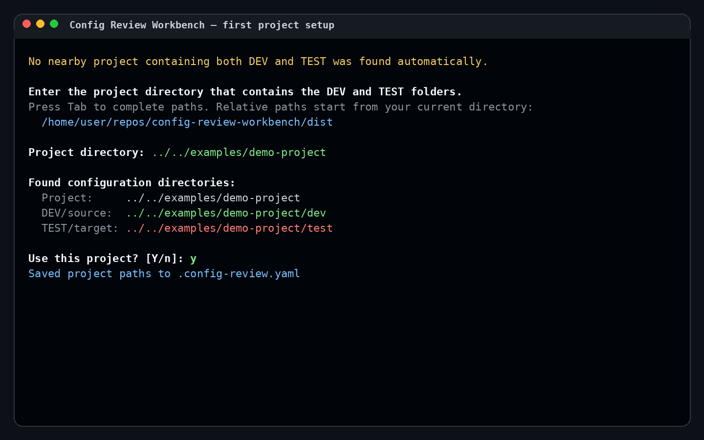
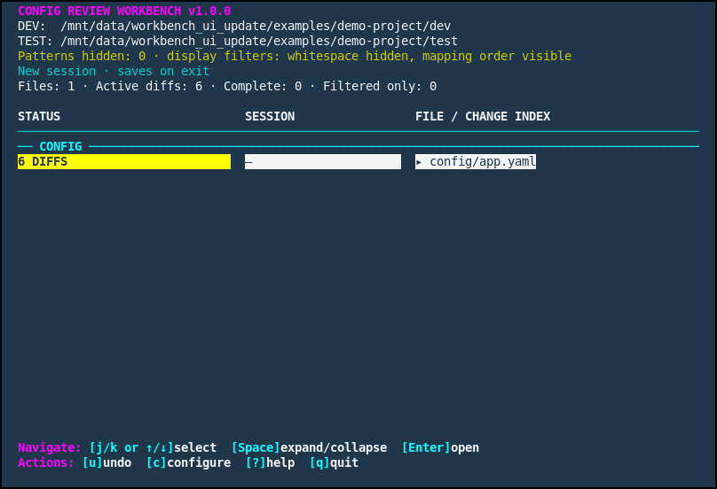
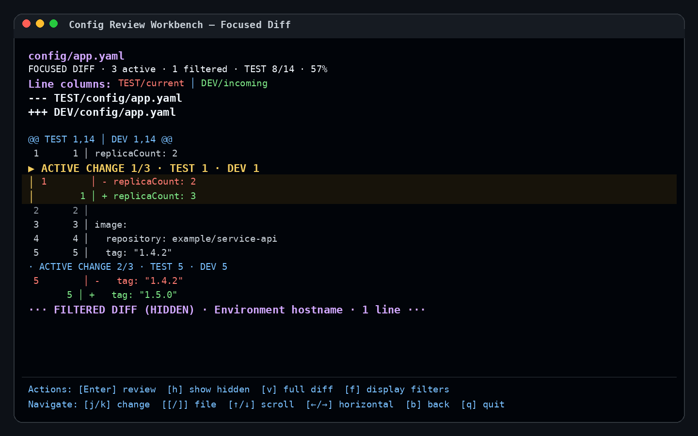
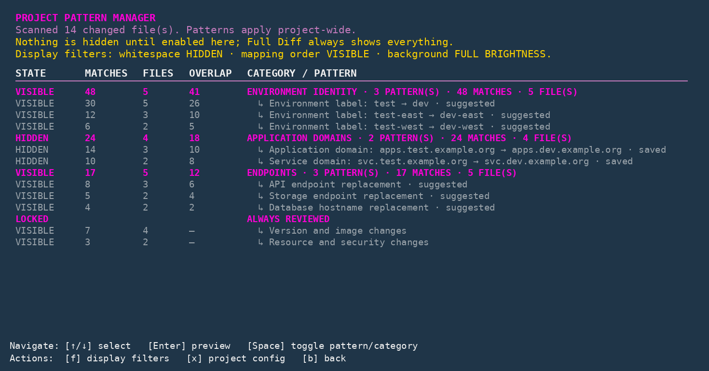
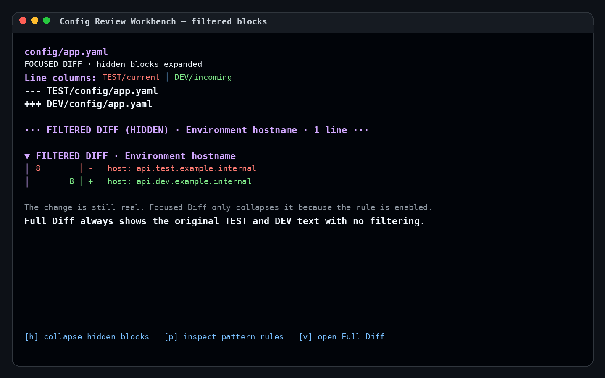

# Config Review Workbench 1.0.0

Config Review Workbench is an interactive terminal application for reviewing exact
configuration differences from **DEV/incoming** into **TEST/current**.

It is designed for Kubernetes, Helm, OpenShift, YAML, and other text-based
configuration repositories. The tool deliberately avoids guessing whether two
configurations are semantically equivalent or whether a change is safe to promote.

## What it provides

- A grouped file list with active, complete, filtered-only, edited, and uncommitted states
- Focused Diff for collapsing approved environment-specific noise
- Full Diff for viewing the complete, literal TEST and DEV text
- A loopback-only, read-only web viewer with a changed-file tree and Focused/Raw views
- Exact per-change actions: accept DEV, keep TEST, edit TEST, or open Vimdiff
- Project-wide noise-filter discovery and user-controlled filtering
- Session history, automatic progress saving, and current-run undo
- Conservative write validation, atomic file replacement, and symlink protection
- A single portable `config-review.pyz` executable for deployment

## Screenshots

### First project setup

On the first run, select one project directory containing sibling `dev` and `test`
directories. Relative paths are resolved from the terminal's current directory, and
Tab completion is supported when Python `readline` is available.



### Main file list

Files are grouped by their directory structure. Expand a file with Space to inspect
its active-change index, or press Enter to open the full Focused Diff. The footer uses
compact rows and automatically condenses on narrower terminals; press `w` for the
read-only web overview or `c` to open Configure for less-common actions.



### Focused Diff

The selected change has a yellow header and vertical guide. TEST/current values are
shown in red, while DEV/incoming values are shown in green.



### Noise Filters

Open **Filters → Noise filters** to audit repeated project-wide replacements that
Focused Diff collapses by default.



### Filtered differences

Filtered changes are still real differences. Focused Diff collapses qualifying noise
by default, while Full Diff always shows the original text.



## Quick start

Run the packaged executable:

```bash
python3 config-review.pyz
```

From a source checkout:

```bash
python3 dist/config-review.pyz
```

The target system needs Python 3.10 or newer. The packaged archive includes the
pure-Python `ruamel.yaml` dependency.

## First-run project setup

The tool first searches nearby workspace directories for a project containing
sibling `dev` and `test` directories.

When no suitable project is found automatically, it asks for one project directory:

```text
Enter the project directory that contains the DEV and TEST folders.
Press Tab to complete paths. Relative paths start from your current directory:
  /home/user/repos/config-review-workbench/dist
Project directory: ../../examples/demo-project
```

You may provide:

- A relative project path
- An absolute project path
- The `dev` or `test` directory itself; the tool will use its parent when the sibling exists

Ctrl+C cancels setup cleanly.

Verified paths are stored in `.config-review.yaml`:

```yaml
version: 9
paths:
  project: ../../examples/demo-project
  source: dev
  target: test
```

Later launches reuse those paths. Explicit command-line paths override the saved
configuration for that run:

```bash
python3 config-review.pyz \
  --source /path/to/project/dev \
  --target /path/to/project/test
```

### Changing comparison paths later

Press `c` from the main file list and open **Comparison paths**. You can either:

- choose a new project root and let the tool find one sibling DEV/TEST pair beneath it; or
- set the exact DEV/source and TEST/target directories for a custom layout.

When review progress exists, the workbench asks to save the current session before
switching. The verified paths are then written to `.config-review.yaml`, the new
project is rescanned immediately, and any saved session for that comparison can be
loaded. Previously saved project noise filters are disabled during the switch so
approvals from one comparison are not carried into another. Newly discovered noise suggestions
still use the quick-review default described below. Display options remain project-configured.

### Configuration behavior across updates

`.config-review.yaml` is local runtime state and is ignored by Git. Pulling a new
source build or replacing `dist/config-review.pyz` does **not** overwrite it. New
defaults apply only when the config file or a setting is missing; explicit existing
settings and filter choices are preserved. The application writes the file only when
you change paths, filters, or other project settings.

## Basic walkthrough

1. **Start the workbench.**

   ```bash
   python3 config-review.pyz
   ```

2. **Select the project directory** containing `dev/` and `test/` when prompted.

3. **Review the main file list.** Yellow rows contain active differences. Green
   `COMPLETE` files have no remaining visible review work. Gray `FILTERED ONLY`
   files still contain differences hidden by approved filters.

4. **Press Enter on a file** to open Focused Diff. Use `j` and `k` to move through
   the next or previous active difference. Arrow keys and Page Up/Page Down navigate
   the current view without changing the selected block.

5. **Press Enter on the selected change** to open its action panel. Choose to accept
   DEV, keep TEST, edit TEST, pull DEV and edit, or open Vimdiff.

6. **Open Full Diff whenever needed.** Full Diff ignores noise filters and display
   options and shows the literal current TEST and DEV text.

7. **Quit normally to save review progress.** The next launch asks whether to restore
   the saved session or start fresh.

## Keyboard controls

### Main file list

| Key | Action |
|---|---|
| `j` / `k`, `↑` / `↓` | Move through files and expanded differences |
| `Space` | Expand or collapse a file's difference index |
| `Enter` | Open the selected file or selected difference |
| `[` / `]` | Previous or next file |
| `w` | Open a read-only local web snapshot of all currently changed files |
| `c` | Open Configure for comparison paths, filters, config editing, and rescan |
| `f` | Open the Filters submenu directly |
| `s` | Rescan DEV and TEST and refresh the Git freshness check |
| `?` | Help |
| `q` | Quit |

Older direct shortcuts remain accepted for compatibility, but less-common actions are
kept out of the footer so the quick-review view stays readable.

### Configure menu

| Item | Purpose |
|---|---|
| Comparison paths | Change the project root or set exact DEV and TEST directories |
| Filters | Open Noise filters or Display options |
| Edit project config | Open `.config-review.yaml` in the configured editor |
| Rescan | Refresh DEV/TEST and rerun the Git freshness check |

### Diff views

| Key | Action |
|---|---|
| `j` / `k` | Next or previous active difference |
| `↑` / `↓`, `Page Up` / `Page Down` | Navigate vertically through the file |
| `←` / `→` | Navigate horizontally |
| `[` / `]` | Previous or next file |
| `Enter` | Open actions for the selected difference |
| `a` | Open File Actions |
| `h` | Expand or collapse filtered blocks |
| `d` | Switch between Focused Diff and Full Diff |
| `f` | Open Filters |
| `?` | Help |
| `b` | Back |
| `q` | Quit |

Vertical and horizontal scrolling reuse the current rendered diff. The workbench rereads
files and rebuilds the presentation only after a file/view/filter/action change or an
explicit rescan, so arrow-key and terminal mouse-wheel scrolling stay responsive on
larger files.

### Local web diff viewer

Press `w` from the main file list to open a browser overview of all currently changed
files. The left side is a searchable directory tree; selecting a file opens its diff.
Use **Focused** for the same filtered quick-review presentation used by the terminal, or
**Raw** for the complete literal TEST-to-DEV diff. Previous/next buttons and `[` / `]`
move between changed files. Hidden Focused sections can be expanded individually, and the
View menu provides system, dark, and light themes.

Every active change includes a review panel. Hidden Focused changes receive the same panel when expanded:

- A deterministic context label describes the type of configuration change.
- **Git context** is loaded on demand and shows the latest relevant incoming DEV commit
  message first, with current TEST history underneath. Exact-line blame is preferred and
  the latest file commit is used as a fallback.
- **File context** shows nearby TEST and DEV lines. Each click can add ten more lines above
  or below until the beginning or end of the file is reached. Expanded context resets when
  the reviewer moves to another file.
- A deployment-note field lets the reviewer record questions, release checks, or follow-up
  work while moving through the changed files.

The browser also has temporary file-level review state. **Hide file** removes a file from
the active tree without calling it reviewed. **Mark reviewed** moves it into the Reviewed
list and includes it in reviewed-files reports. The **Review** menu can restore hidden files,
reopen or unreview reviewed files, save a plaintext reviewed-files report, or open the
browser print dialog for that report. These choices exist only in the current page and reset
when the viewer is refreshed or closed.

Use **Save review…** to export changes in the current Focused or Raw mode, their Git
context, and inline notes to a plaintext `.txt` file. Focused export includes active changes
plus any hidden change that the reviewer deliberately annotated; Raw export includes every
literal change. Edge and other Chromium browsers use a native save dialog when available;
other browsers fall back to a normal download. Notes stay only in the current browser page
until exported and are never written into DEV, TEST, Git, or the workbench configuration.

The viewer is still review-only for project content:

- It contains no merge, edit, terminal-completion, undo, or filter-configuration actions.
  Browser-only Reviewed status is temporary review metadata and does not update the terminal
  workbench session.
- It serves an in-memory snapshot and does not reread files in the background. Reopen it
  from the terminal to refresh after files or filters change.
- It binds only to `127.0.0.1` on a random port and uses a random URL token.
- HTML, CSS, and JavaScript are bundled locally; no CDN, telemetry, or external request is
  used.
- The server exposes only diff presentation data, bounded snapshot context, and read-only
  Git metadata for known changes. It does not provide arbitrary file access or a file-write
  endpoint.

Under WSL, the launcher uses one Windows browser handoff instead of trying multiple Linux
openers, avoiding duplicate tabs and noisy `gio` errors. When a browser cannot be opened
automatically, the terminal status line prints the local URL. Remote SSH sessions may
require local port forwarding before that URL is reachable
from your workstation. See [Local Web Diff Viewer](docs/web-diff-viewer.md) for the exact
review, export, and security behavior.

### File Actions and visible-diff reports

File Actions keeps file-level work out of the main footer. It contains manual
complete/reopen, current-run undo, whole-file DEV-to-TEST copy/delete, and a report for
the current file.

The **Visible-diff report** is intentionally scoped to the current view:

- Focused Diff reports include only currently selectable differences; hidden noise and
  handled changes are omitted.
- Full Diff reports include the literal selectable text differences.
- Context labels can be enabled to classify changes deterministically as environment
  variables, routing, resources, security, logging, schedules, and similar categories.
- Git commit context can be enabled. The report tries line-level `git blame` first and
  falls back to the latest commit touching the DEV or TEST file when attribution is
  ambiguous.

Reports can be opened in the configured editor, saved as Markdown under
`reports/`, or printed to the terminal. Reports use a compact review summary, numbered
change sections, TEST-to-DEV diff blocks, and an optional Git-context table. Paths are
shortened relative to the project when possible. The visible report directory is ignored
by Git. When the current view has no selectable differences, report actions are disabled
and no empty report file or directory is created.

### Git freshness check

At startup, the workbench performs a best-effort, read-only Git check. When the current
branch has an upstream, it runs a non-interactive `git fetch --prune --no-tags`, then
shows whether the branch is ahead, behind, or up to date and whether the working tree
has local changes. It never pulls, merges, resets, or modifies tracked files.

If fetching fails because the network or credentials are unavailable, the workbench
continues and clearly marks remote freshness as unverified. Rescan reruns the check.

For the exact report scope, context-label rules, blame fallback, and Git-check behavior,
see [Visible-Diff Reports and Git Context](docs/reports-and-git-context.md).

## Focused Diff and Full Diff

**Focused Diff** starts in a quick-review mode: whitespace-only blocks, safe YAML
order-only changes, and discovered repeated noise filters are collapsed by default.
Every collapsed block remains represented by a marker explaining why it is hidden.
Saved per-filter choices override the generated default.

**Full Diff** never hides anything. It is the authoritative view when you need to
inspect the exact TEST/current and DEV/incoming text.

## Noise Filters

Open **Filters → Noise filters** to inspect repeated project-wide replacements. It
scans the current set of changed files for repeated TEST/current → DEV/incoming replacements and
groups suggestions into categories such as environment identity, application
domains, endpoints, user references, and storage identifiers.

Noise-filter suggestions are **hidden by default** for an at-a-glance review. Category
rows start collapsed so the screen initially shows only the summary. Press `Enter` to
expand a category, then use `Space` to show any filter that should not be treated as
noise. Full Diff remains completely literal.

### Understanding the columns

| Column | Meaning |
|---|---|
| `STATE` | `VISIBLE` means matching changes remain expanded in Focused Diff. `HIDDEN` means the rule is enabled and matching changes are collapsed. `LOCKED` identifies always-reviewed changes that noise filters cannot hide. |
| `MATCHES` | Number of changed blocks matched by the filter or category. |
| `FILES` | Number of unique files containing those matches. |
| `OVERLAP` | Number of matched blocks also covered by another suggested or saved filter. |
| `CATEGORY / FILTER` | The filter group and the individual replacement rule. |

A hidden change is not removed, accepted, or marked complete. It is only collapsed
in Focused Diff with a `FILTERED DIFF (HIDDEN)` marker and a brief reason. Full Diff
always shows the original TEST and DEV lines.

### Reviewing noise-filter defaults

- Use `↑` / `↓` or `j` / `k` to select a row.
- Press `Enter` on a category to expand or collapse it.
- Press `Enter` on a filter to preview its regexes and matching examples with nearby
  context.
- Press `Space` on an individual filter to hide or show it.
- Press `Space` on a category to hide or show every filter in that category.
- Use the Filters submenu to open Display options.
- Press `x` to inspect or edit `.config-review.yaml`.

Review broad or surprising filters before relying on the quick view. Suggested
filters are regex-based evidence of a repeated replacement, not proof that the two
values are semantically equivalent. Broad hostname or endpoint suggestions deserve
particular scrutiny; show them when they are relevant to the release.

When a changed block matches several filters, `OVERLAP` reports that relationship.
The block remains hidden while **any** enabled matching filter still applies. All
matching reasons remain available in Filter Details.

Noise-filter choices are saved in `.config-review.yaml` and apply across the whole
project on later runs. A saved `VISIBLE` choice overrides the hidden-by-default
behavior for that rule.

For the exact candidate-generation rules and safeguards, see
[Filter Discovery Logic](docs/filter-discovery.md). For text alignment, keyed YAML
list handling, fallbacks, and merge safety, see
[Diff Engine and Keyed YAML Lists](docs/diff-engine.md).

### Always-reviewed changes

Noise-filter rules cannot hide protected changes such as:

- Versions, image tags, chart versions, and revisions
- Replica counts and CPU or memory resources
- Security-related settings
- Additions and removals
- Structural changes

These rows appear as `LOCKED` or remain `VISIBLE`, even when nearby environment
differences are filtered.

## Display options

Display options are separate from project noise filters:

- Show or hide whitespace-only changes
- Hide safe YAML order-only changes, including exact mapping moves and unique
  `name`-keyed list moves
- Mute non-focused diff content

Display options change how Focused Diff is presented. Full Diff remains completely
unfiltered.

## Applying changes safely

Accept DEV revalidates the selected hunk immediately before writing. If the current
TEST content no longer matches the reviewed block uniquely, the tool refuses the
operation and leaves the file untouched.

TEST writes use atomic replacement and preserve existing file modes. Symlinked TEST
paths are viewable but intentionally blocked from modification.

## Sessions and undo

Review progress is saved automatically when the tool exits. Saved sessions contain
fingerprints and review metadata rather than raw changed configuration values.

Undo Session Changes restores the selected TEST file to its state at the beginning
of the current process while preserving changes that already existed before launch.
Exact undo bytes are captured lazily before the tool's first write and remain
memory-only, so undo is unavailable after the process exits.

## Demo project

A sanitized sample project is included under:

```text
examples/demo-project/
├── dev/config/app.yaml
└── test/config/app.yaml
```

Run the workbench from the repository and choose `examples/demo-project` during
project setup to explore the basic workflow without using a real configuration repo.

## Development commands

Install the development tools once inside a virtual environment:

```bash
python3 -m venv .venv
source .venv/bin/activate
python -m pip install -r requirements-dev.txt
```

The Makefile provides short, consistent commands for local development:

```bash
make help       # List all available commands
make test       # Run pytest
make self-test  # Run the application regression suite from source
make lint       # Compile Python and run Ruff correctness checks
make format     # Apply safe Ruff fixes and format Python files
make security   # Run Bandit and dependency vulnerability checks
make check      # Run all read-only checks
make build      # Test, build, and validate the packaged .pyz
make clean      # Remove generated build and cache files
```

The commands are intentionally separate. `make check` is read-only and is the best
final check before committing or pushing. `make format` is separate because it modifies
source files. `make build` validates both the source application and the generated
portable archive, since packaging can introduce problems that source-only tests cannot
catch.

## Build

Install the build dependency and create the portable executable:

```bash
python3 -m pip install -r requirements-build.txt
make build
```

The portable executable is created at:

```text
dist/config-review.pyz
```

## Test without Make

The underlying commands remain available when `make` is not installed:

```bash
python3 -m pytest -q
PYTHONPATH=src python3 -m config_review --self-test
python3 dist/config-review.pyz --self-test
python3 scripts/check_project.py all
```

## Run from source

```bash
PYTHONPATH=src python3 -m config_review \
  --source examples/demo-project/dev \
  --target examples/demo-project/test
```

## Source layout

- `core.py` — models, configuration, file safety, diff/filter engine, and sessions
- `rendering.py` — Focused Diff, Full Diff, summaries, and presentation building
- `workbench.py` — repository state and review actions
- `web_view.py` — loopback-only read-only browser diff snapshot
- `tui.py` — curses interface
- `plain.py` — line-oriented fallback interface
- `self_test.py` — built-in regression suite
- `cli.py` — command-line parsing and application startup

The source is modular for development and testing, while releases remain a single
portable executable archive.

## License

Config Review Workbench is available under the MIT License. See [LICENSE](LICENSE).

The portable `.pyz` bundles `ruamel.yaml`. Its copyright and license terms are
included in [THIRD_PARTY_NOTICES.md](THIRD_PARTY_NOTICES.md) and inside the built
archive.

## Known limitations

- Python 3.10 or newer is required.
- The curses TUI is intended primarily for Linux, macOS, WSL, and SSH terminals.
- The web viewer is available only on the machine running the workbench unless an SSH
  tunnel or equivalent loopback forwarding is configured.
- The tool compares configuration as text and does not determine whether a change is
  operationally correct or safe to deploy.
- YAML order filtering requires unambiguous parseable YAML. Duplicate named list
  items, templates that do not parse, and partial or mixed list structures fall back
  to the literal text diff.
- Current-run undo does not persist after the application exits.

## Release model

This repository begins its public release history at **1.0.0**. Features added during
initial development remain part of the 1.0.0 working release until a later public
version is explicitly chosen. Earlier build numbers were internal development
iterations and are not part of the published version history.
